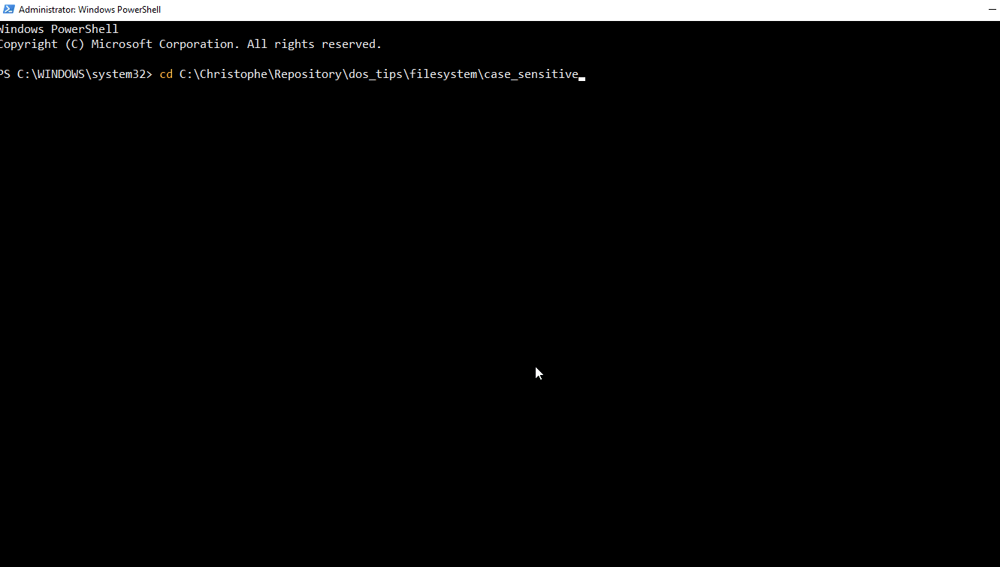

# Enable case sensitivity for DOS

> source [https://www.howtogeek.com/354220/how-to-enable-case-sensitive-folders-on-windows-10/](https://www.howtogeek.com/354220/how-to-enable-case-sensitive-folders-on-windows-10/)

Under DOS / Windows, filenames are not case sensitive. This means that `myFile.php`, `myfile.php`, `MYFILE.PhP` and all others variants are one unique file.

To try this, just open a DOS Prompt Session and run these three commands. Did you get three new files in your current folder? No, just `myFile.php`, the first created one.

Open that file? What did you see? His content will be `This is MYFILE.PhP` i.e. the result of our third command.

Other OS like Linux are case sensitive and we'll then get there three files with the correct content each time.

```bash
echo "This is myFile.php" > myFile.php
echo "This is myfile.php" > myfile.php
echo "This is MYFILE.PhP" > MYFILE.PhP
```


Is it possible to enable case sensitivity under DOS? Yeah! It's possible.

1. Start a `Windows PowerShell` prompt with admin rights,
2. Go inside the folder where you want to enable case sensitivity,
3. Type `fsutil.exe file setCaseSensitiveInfo . enable` to enable it (or `disable` to remove it)

Check once more:



As you can see, now, we've our three files and the content of tye `myFile.php` is well `This is myFile.php`, as expected. Same for the two others files.

If you're a PHP programmer f.i., enabling case sensitivity is nice because you'll directly see under Windows a fatal error on `require_once myFILE.php` since that file didn't exists.
