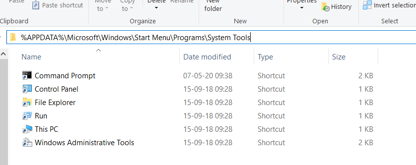
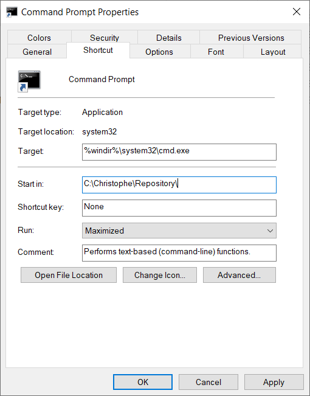
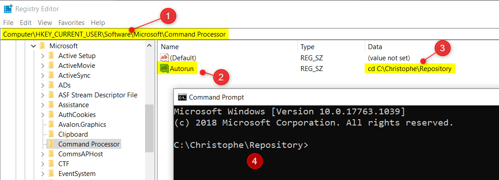

# Default folder when starting the DOS prompt

By running `CMD`, Windows will start the DOS Prompt and you'll be located in your user profile folder (`%USERPROFILE%`)

You can change this behavior by either updating the command prompt *Start in* property or by creating a new entry in your registry.

## Start in property

1. Start the File Explorer
2. Go to `%APPDATA%\Microsoft\Windows\Start Menu\Programs\System Tools`

    

3. Right-click on the `Command Prompt` shortcut
4. Update the `Start in` property to the default folder of your choice. *Note: you can also decide to start the DOS prompt console maximized.*

    

## Registry

1. Run `regedit`
2. Navigate to `Computer\HKEY_CURRENT_USER\Software\Microsoft\Command Processor`
3. Create a new key `Autorun`, string one
4. Type a `cd` (change directory) command followed by your preferred one like `IF /I x"%COMSPEC%"==x%CMDCMDLINE% (cd /D c:\christophe\repositories)`

*The `IF` statement here above allows to execute the `cd` command only when the DOS prompt is started from the `CMD` command under Windows and not from a current, existing, DOS session.*

From now, when you'll start `CMD` you'll be directly in that folder.

