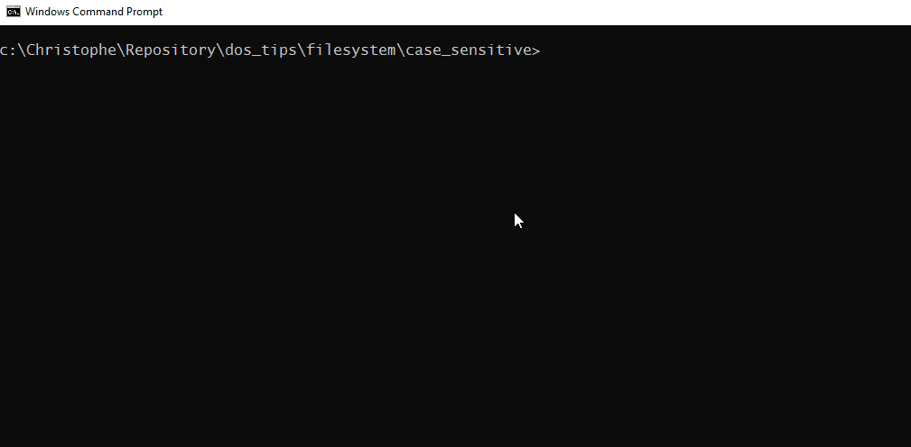
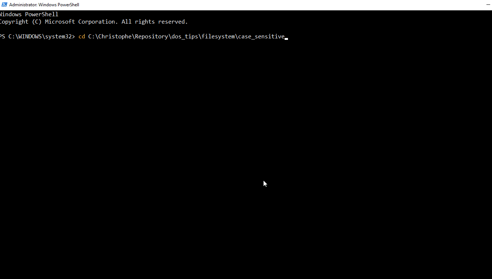
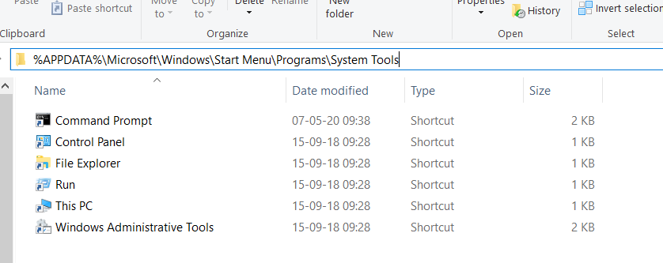
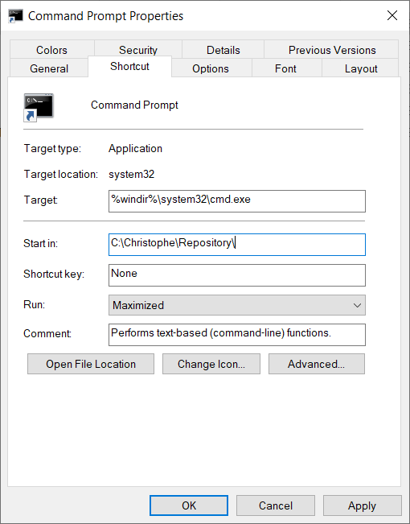
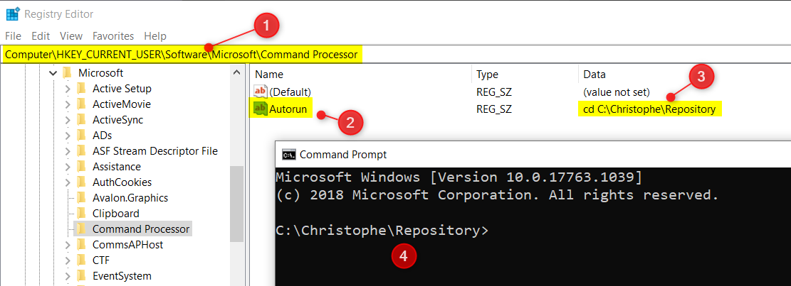

<!-- This file has been generated by the concat-md.ps1 script. -->
<!-- Don't modify this file manually (you'll loose your changes) -->
<!-- but run the tool once more -->

<!-- Last refresh date: 2021-01-08 11:26:00 -->

<!-- below, content of ./index.md -->

<!-- markdownlint-disable MD032 -->
# DOS tips


<!-- table-of-contents - start -->
* [File copy](#file-copy)
  * [Copy a set of folders and exclude some](#copy-a-set-of-folders-and-exclude-some)
* [File system](#file-system)
  * [Enable case sensitivity for DOS](#enable-case-sensitivity-for-dos)
* [DOS prompt](#dos-prompt)
  * [Default folder when starting the DOS prompt](#default-folder-when-starting-the-dos-prompt)
    * [Start in property](#start-in-property)
    * [Registry](#registry)
* [License](#license)
<!-- table-of-contents - end -->

<!-- below, content of ./010-filecopy/readme.md -->

## File copy

<!-- below, content of ./010-filecopy/exclusions/readme.md -->

### Copy a set of folders and exclude some

Copies a set of folders excluding certain sub-folders; f.i. exclude `.git` folder (which can quickly be a very big folder), `node_modules` and `vendor` which are unneeded because they can be reconstructed with an `npm install` and a `composer update`.

```bash
cd c:\repositories
robocopy . c:\backup\. /IS /S /XD .git node_modules vendor
```

These two lines will allow you to copy everything from `c:\repositories` to `c:\backup`, rewrite files even if they're present in the backup folder, copying symlinked folder and exclude a few folders.

<!-- below, content of ./020-filesystem/readme.md -->

## File system

<!-- below, content of ./020-filesystem/case_sensitive/readme.md -->

### Enable case sensitivity for DOS

> source [https://www.howtogeek.com/354220/how-to-enable-case-sensitive-folders-on-windows-10/](https://www.howtogeek.com/354220/how-to-enable-case-sensitive-folders-on-windows-10/)

Under DOS / Windows, filenames are not case sensitive. This means that `myFile.php`, `myfile.php`, `MYFILE.PhP` and all others variants are one unique file.

To try this, just open a DOS Prompt Session and run these three commands. Did you get three new files in your current folder? No, just `myFile.php`, the first created one.

Open that file? What did you see? His content will be `This is MYFILE.PhP` i.e. the result of our third command.

Other OS like Linux are case sensitive and we'll then get there three files with the correct content each time.

```bash
echo "This is myFile.php" > myFile.php
echo "This is myfile.php" > myfile.php
echo "This is MYFILE.PhP" > MYFILE.PhP
```



Is it possible to enable case sensitivity under DOS? Yeah! It's possible.

1. Start a `Windows PowerShell` prompt with admin rights,
2. Go inside the folder where you want to enable case sensitivity,
3. Type `fsutil.exe file setCaseSensitiveInfo . enable` to enable it (or `disable` to remove it)

Check once more:



As you can see, now, we've our three files and the content of tye `myFile.php` is well `This is myFile.php`, as expected. Same for the two others files.

If you're a PHP programmer f.i., enabling case sensitivity is nice because you'll directly see under Windows a fatal error on `require_once myFILE.php` since that file didn't exists.

<!-- below, content of ./030-prompt/readme.md -->

## DOS prompt

<!-- below, content of ./030-prompt/default_folder/readme.md -->

### Default folder when starting the DOS prompt

By running `CMD`, Windows will start the DOS Prompt and you'll be located in your user profile folder (`%USERPROFILE%`)

You can change this behavior by either updating the command prompt *Start in* property or by creating a new entry in your registry.

#### Start in property

1. Start the File Explorer
2. Go to `%APPDATA%\Microsoft\Windows\Start Menu\Programs\System Tools`

    

3. Right-click on the `Command Prompt` shortcut
4. Update the `Start in` property to the default folder of your choice. *Note: you can also decide to start the DOS prompt console maximized.*

    

#### Registry

1. Run `regedit`
2. Navigate to `Computer\HKEY_CURRENT_USER\Software\Microsoft\Command Processor`
3. Create a new key `Autorun`, string one
4. Type a `cd` (change directory) command followed by your preferred one like `IF /I x"%COMSPEC%"==x%CMDCMDLINE% (cd /D c:\christophe\repositories)`

*The `IF` statement here above allows to execute the `cd` command only when the DOS prompt is started from the `CMD` command under Windows and not from a current, existing, DOS session.*

From now, when you'll start `CMD` you'll be directly in that folder.



<!-- below, content of ./999-license/readme.md -->

## License

[MIT](./../LICENSE)
